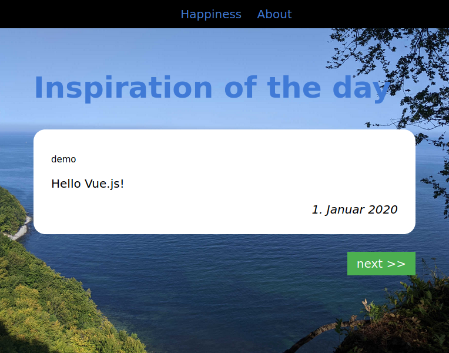

# Inspiration of the day



Shows a predefined inspiration message of the day.

## Requirements

The inspiration-app will require Node.js. [See guide](https://github.com/nodesource/distributions#debinstall)

	$ curl -fsSL https://deb.nodesource.com/setup_23.x -o nodesource_setup.sh
	$ sudo -E bash nodesource_setup.sh
	$ sudo apt-get install -y nodejs

The JavaScript-Frameworks [Vue.js](https://vuejs.org/) and [Vue Router](https://router.vuejs.org/)
will be used. [See guide](https://vuejs.org/guide/quick-start.html#with-build-tools)

	Start a new development
	$ npm init vue@latest

	Update development
	inspiration-app$ npm update

The console.log output should removed in deployment. [See guide](https://reactjsexample.com/a-vite-plugin-that-deletes-console-log-in-the-production-environment)

	$ npm install vite-plugin-remove-console -D

The npm daemon's from the `Makefile` are managed by pm2 globaly. [See guide](https://medium.com/idomongodb/how-to-npm-run-start-at-the-background-%EF%B8%8F-64ddda7c1f1) - Note: This is optional, otherwise you have to start npm manually (`npm run dev` or `npm run preview`).

	$ sudo npm install pm2 -g

Tests with screenshots are done with percy and python-selenium. [See guide](https://docs.percy.io/docs/python-selenium) - Note: This is optional, otherwise `make test` adds no value.

	$ sudo apt install python3-pip firefox
	$ pip install percy-selenium
	inspiration-app$ npm install --save-dev @percy/cli

Quick start development after git clone

	$ npm ci
	$ cd inspiration-app
	$ npm run dev

## Deployment

Start a daemon for compile and hot-reload in development on [http://localhost:3000/]

	$ make dev

Start daemon for preview with added branding before production on [http://localhost:4173/]

	$ make prod

Run the tests with screenshots

	$ export PERCY_TOKEN=[your-projects-token]
	$ export SE_GECKODRIVER=/snap/bin/geckodriver
	$ make test

Now, you just need to put the `dist` directory on a web server.

	$ make install

## Writing quotes

Just edit `quotes.js` and write in your quotes.

With *LibreOffice Calc* it is a little bit easier:

1. create a list of all days

day | author | message
-- | -- | --
1-jan | demo | Hello Vue.js!
2-feb | |
15-aug | |
31-dec | |

2. run a macro to export all quotes to json: [OpenOffice Export to JSON](https://gist.github.com/aaronhoogstraten/49b9c0f5e4ac705ebe51)

For quotes on "happiness", the result might look like:

```
const quotesjs = {
    happiness: [
        {
            message: 'Hello Vue.js!',
            author: 'demo',
            day: '1-jan'
        }, {
            message: '',
            author: '',
            day: '1-feb'
        }, {
            message: '',
            author: '',
            day: '15-aug'
        }, {
            message: '',
            author: '',
            day: '31-dec'
        }
    ]
}

export default quotesjs
```

## Credits

* Tag für Tag Glück, ISBN 978-3625117957
* Tag für Tag Liebe, ISBN 978-3625117964
